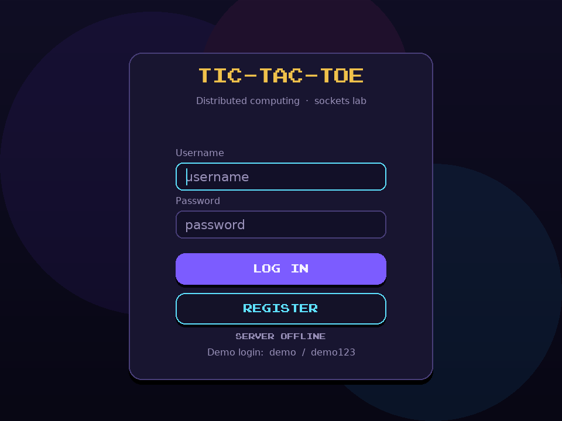
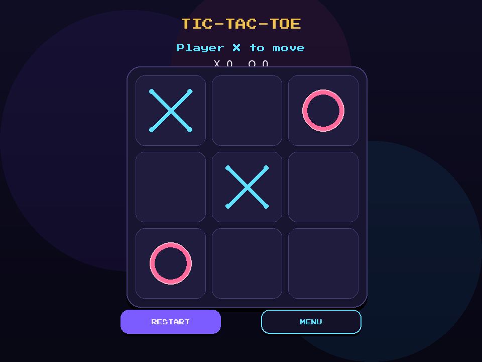
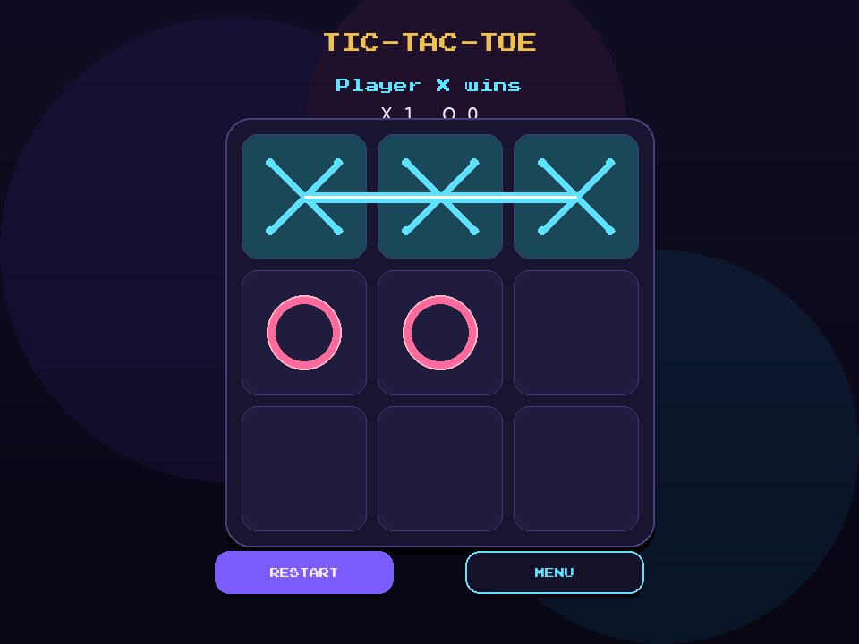

# Tic-Tac-Toe over sockets

A two-player **Tic-Tac-Toe** client in Python (Pygame) plus a small **C TCP authentication server**. Login accounts are stored locally and can be verified over sockets on port `8080`.

Team: [@Sastiazaran](https://github.com/Sastiazaran) · [@PabloUsc](https://github.com/PabloUsc) · [@PapaDeAsti-RoloBolo](https://github.com/PapaDeAsti-RoloBolo)

## What you get

| Piece | Role |
| --- | --- |
| `client/ticTacToe.py` | Arcade-style desktop client: login, menu, hot-seat match |
| `client/game_logic.py` | Board rules (moves, wins, ties) with unit tests |
| `Servidor_Cliente/servidorTicTacToe.c` | Auth server — accepts `username\\npassword\\n` |
| `Servidor_Cliente/clienteTicTacToe.c` | Command-line auth client for testing the server |
| `data/users.txt` | Account file shared by Python and C (`username sha256`) |

The match itself is **hot-seat** (two people at one keyboard). The socket layer authenticates players so the lab still exercises real TCP.

## Screens

The client uses a midnight-arcade look: neon **X** (cyan) and **O** (pink), hoverable cells, a win line, and a persistent scoreboard.





## Requirements

- Python 3.10+
- [Pygame](https://www.pygame.org/) 2.5+
- `gcc` (for the C server / client)

```bash
python3 -m pip install -r requirements.txt
```

## Run the Python game

From the repository root:

```bash
python3 client/ticTacToe.py
```

A demo account is created on first launch:

- username: `demo`
- password: `demo123`

**In game**

- Click an empty cell to place a mark. X always starts.
- Three in a row wins. A full board with no winner is a tie.
- **Restart** (or Space) starts a new round and records the winner on the scoreboard.
- **Menu** (or Enter / Esc) returns to the main menu.

Register a new user from the login screen. Usernames are 3–16 letters, numbers, or underscores; passwords must be at least 4 characters.

## Run the C auth server

```bash
make
./Servidor_Cliente/servidor
```

In another terminal:

```bash
./Servidor_Cliente/cliente 127.0.0.1 demo demo123
```

Expected reply: `Auth successful`.

Protocol:

1. Client connects to `127.0.0.1:8080`.
2. Client sends `username\\npassword\\n`.
3. Server answers `Auth successful` or `Auth failed`.

The Python login screen shows **SERVER ONLINE** when this process is listening. Logging in then also checks the same credentials over TCP. If the server is down, local login still works.

The original demo password `password123` is still accepted by the C server so older clients keep working.

## Tests

```bash
make test
```

This covers win/tie detection, illegal moves, and account registration. After `make`, you can also confirm Python and C produce the same SHA-256:

```bash
gcc -Wall -o tests/hash_check tests/hash_check.c
python3 -c "import hashlib; print(hashlib.sha256(b'demo:demo123').hexdigest())"
./tests/hash_check demo:demo123
```

## Project layout

```
client/                 Pygame UI, board logic, local accounts
Servidor_Cliente/       C socket server and demo client
tests/                  Unit tests
data/                   Runtime users file
docs/                   UI preview images
```

## Notes

This started as a distributed-computing class project. The README used to describe planned work (chat, Docker, C++); the tree above is what actually ships.

Run commands from the **repository root** so `data/users.txt` and the bundled font resolve correctly.
